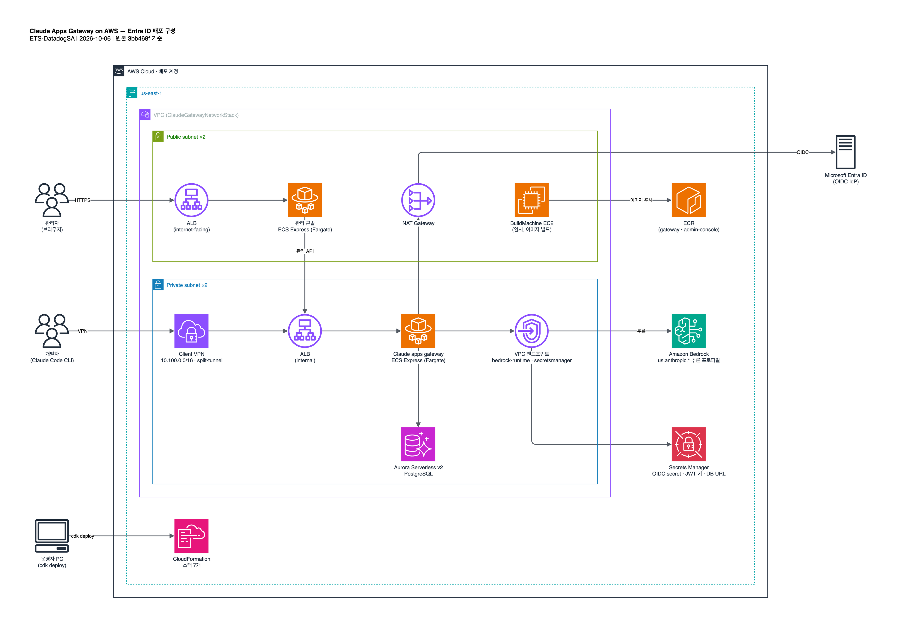
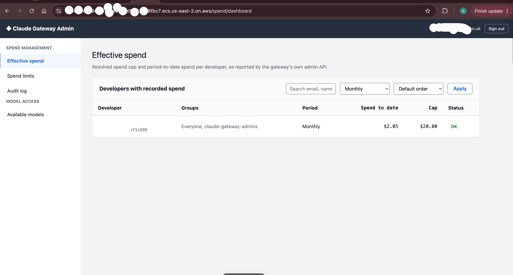
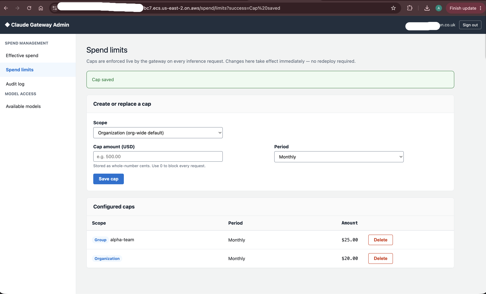
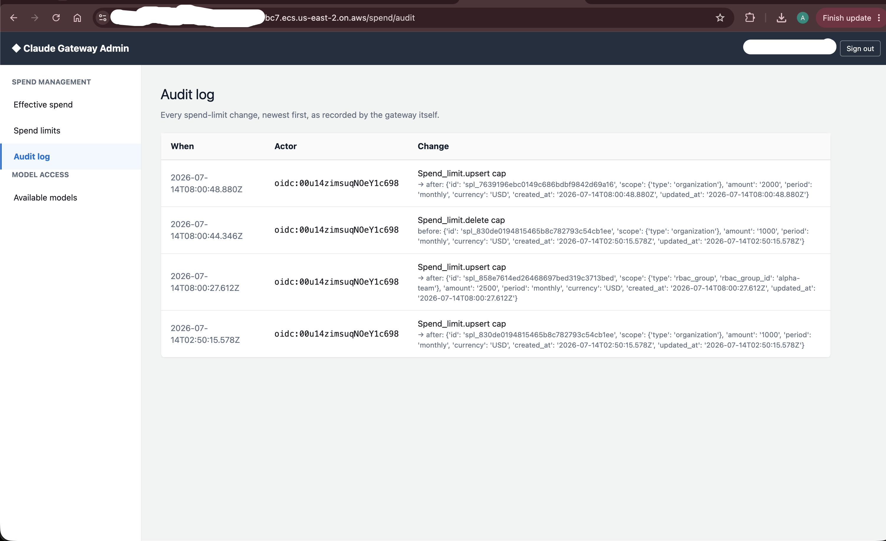
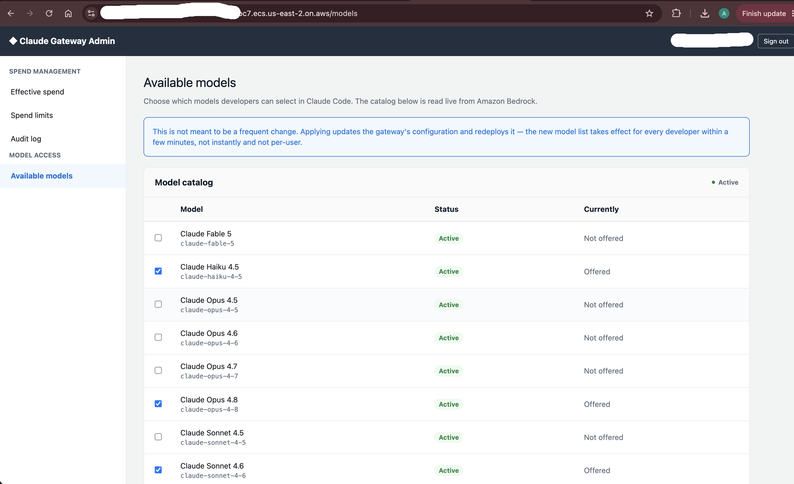

# Claude Apps Gateway on AWS - Entra ID 기반 배포 가이드
> [!NOTE]
> Entra ID 연동의 경우 구성되어 있는 Entra의 환경에 따라 OIDC 연동 방법이 다를 수 있습니다. \
> 해당 레포지터리의 Entra ID 연동의 경우 최소한의 구성을 기준으로 테스트 되었습니다.

[aws-samples/sample-claude-apps-gateway-on-aws](https://github.com/aws-samples/sample-claude-apps-gateway-on-aws)를 **Microsoft Entra ID**를 IdP 로, **us-east-1** 리전에 배포하는 절차입니다. \
결과물은 Amazon Bedrock 앞단의 Claude apps gateway, 관리 콘솔, 접속용 AWS Client VPN 입니다.

원본 리포의 문서([docs/original/](docs/original/README.md))는 Okta 기준입니다. \
이 가이드는 원본 문서를 옮기고, Entra 로 바뀌는 지점과 배포가 어디서 일어나는지를 더했습니다.

## 문서 순서

> [!NOTE]
> - 모든 단계는 같은 Shell에서 이어서 진행하는 것을 전제로 합니다.
> - 앞 단계에서의 셸 변수 (`APP`, `SECRET`, `GRP`, `ISSUER`)를 차후 챕터에서도 활용합니다.
> - 신규 Shell을 열었을 경우 [4. CDK 배포](docs/04-deploy.md#45-새-셸에서-변수-복원)의 복원 방법을 따릅니다.

| 순서 | 문서 | 내용 |
| --- | --- | --- |
| 1 | [Entra ID 앱 등록](docs/01-entra-id.md) | 앱 등록, groups 클레임, client secret, 어드민 그룹, issuer |
| 2 | [AWS 배포 준비](docs/02-aws-preparation.md) | 리포 clone, 도구, 리전·자격증명, Bedrock·Aurora 확인 |
| 3 | [Entra 용 설정값 반영](docs/03-configure-source.md) | Okta 기준 설정 세 곳과 Entra 값, 어드민 그룹 GUID 채우기 |
| 4 | [CDK 배포](docs/04-deploy.md) | `cdk bootstrap`, `cdk deploy --all`, 출력값 기록 |
| 5 | [VPN 연결과 리다이렉트 URI](docs/05-vpn-and-redirect.md) | VPN 프로필 연결, Entra 리다이렉트 URI 를 실제 값으로 교체 |
| 6 | [배포 확인](docs/06-verify.md) | 헬스체크, 콘솔 사인인, 비용 한도, 모델, 실제 추론 |
| 7 | [관리 콘솔 사용법](docs/07-admin-console.md) | 사용액 대시보드, 비용 한도, 모델 접근 관리와 감사 방식 |
| 8 | [커스텀 추론 프로파일 (선택)](docs/08-custom-inference-profile.md) | 특정 모델을 application inference profile 로 보내기 |
| 9 | [업데이트와 삭제](docs/09-update-and-cleanup.md) | 재배포, `cdk destroy`, Entra 정리 |
| 10 | [문제 해결](docs/10-troubleshooting.md) | 증상별 원인과 조치 |

## Requirement

### 필요한 도구
| 도구 | 버전 | 어디에 쓰나 | 확인 명령 |
| --- | --- | --- | --- |
| Node.js | 20 이상 | CDK 실행 (`npx cdk`) | `node --version` |
| AWS CLI | v2 | 자격증명 확인, 스택 출력값·VPN 프로필 조회 | `aws --version` |
| Azure CLI (`az`) | - | Entra 앱·그룹 생성 ([1단계](docs/01-entra-id.md)) | `az version` |
| `jq` | - | VPN 프로필 추출, 컨텍스트 파일 저장·복원 | `jq --version` |
| Docker 또는 `esbuild` | `esbuild` 는 `^0.21` | Lambda 번들링 ([2.2](docs/02-aws-preparation.md#22-의존성과-번들러)) | `docker info` 또는 `cdk/` 에서 `npx esbuild --version` |
| OpenVPN 클라이언트 | - | 프라이빗 게이트웨이 접속 ([5단계](docs/05-vpn-and-redirect.md)). [OpenVPN Connect 다운로드](https://openvpn.net/client/) | - |

AWS CDK CLI 는 `cdk/package.json` 에 들어 있어 따로 설치하지 않습니다(`npm install` 후 `npx cdk`).

### 설치 방법

> [!NOTE]
> - macOS 는 [Homebrew](https://brew.sh), Windows 는 winget 으로 설치합니다.
> - Windows 는 이후 모든 명령을 Git Bash 에서 실행합니다. Windows 전체 절차는 아직 검증하지 않았습니다.

#### macOS

1. nodejs, awscli, azure-cli, jq 패키지 설치
```bash
brew install node awscli azure-cli jq
```
2. docker desktop 패키지 설치 (`esbuild` 를 쓸 거라면 생략)
```bash
brew install --cask docker-desktop
```

#### Windows

PowerShell 에서 설치합니다. 마지막 줄(Docker Desktop)은 `esbuild` 를 쓸 거라면 생략합니다.

```powershell
winget install --id Git.Git -e
winget install --id OpenJS.NodeJS.LTS -e
winget install --id Amazon.AWSCLI -e
winget install --id Microsoft.AzureCLI -e
winget install --id jqlang.jq -e
winget install --id Docker.DockerDesktop -e
```

설치 후 Git Bash 를 새로 열어야 PATH 가 반영됩니다.

### 계정과 권한

| 대상 | 필요한 것 | 확인 위치 |
| --- | --- | --- |
| AWS | IAM 롤 생성 권한 (스택 10개, `cdk bootstrap` 5개) | [2.3](docs/02-aws-preparation.md#23-리전과-자격증명-고정) |
| Amazon Bedrock | Anthropic 모델 [모델 액세스](https://docs.aws.amazon.com/bedrock/latest/userguide/model-access.html), `us.anthropic.*` 추론 프로파일 | [2.4](docs/02-aws-preparation.md#24-bedrock-추론-프로파일-확인) |
| Microsoft Entra ID | 앱 등록·그룹 생성 권한 | [1.1](docs/01-entra-id.md#11-로그인) |

> [!TIP]
> 필요한 도구를 한 번에 확인합니다. 없는 도구에서 멈춥니다.
>
> ```bash
> node --version && aws --version && az version --output table && jq --version
> ```


## 배포 방법

명령은 운영자 PC 에서 실행하고, 리소스는 배포 계정 us-east-1 에 CloudFormation 스택 7개로 올라갑니다. 컨테이너 이미지는 AWS 안의 임시 EC2 가 빌드합니다.



구성 요소와 흐름은 [docs/architecture.md](docs/architecture.md), 편집용 파일은 [docs/architecture.drawio](docs/architecture.drawio) 입니다.

| 항목 | 값 |
| --- | --- |
| 소스 | 이 리포. 원본 [aws-samples/sample-claude-apps-gateway-on-aws](https://github.com/aws-samples/sample-claude-apps-gateway-on-aws) `main`(3bb468f) + Entra 설정 두 곳 |
| 명령 실행 위치 | 운영자 PC. 3단계는 리포 루트, 4단계부터 `cdk/` |
| 리전 | `us-east-1` (`us.anthropic.*` 추론 프로파일 전제) |
| IdP | `az login` 한 Entra ID 테넌트 |
| 이미지 빌드 | 임시 x86_64 EC2(BuildMachine)가 빌드해 ECR 에 푸시 후 종료 |
| Lambda 번들링 | 운영자 PC (`esbuild`, 없으면 Docker) |
| 접속 경로 | 게이트웨이는 VPN 으로만 접근. 관리 콘솔은 퍼블릭이지만 사인인에 VPN 필요 |

> [!IMPORTANT]
> `gateway/`·`admin-console/` 는 PC 의 로컬 트리에서 그대로 패키징됩니다. 다른 수정이 섞이지 않도록 배포용 트리는 새로 clone 합니다.

<details>
<summary>게이트웨이는 프라이빗, 관리 콘솔은 퍼블릭인 이유</summary>

게이트웨이 서브넷에는 인터넷 경로가 없어 ECS Express Mode 가 내부 로드밸런서를 붙입니다. 개발자는 VPN 을 거쳐 CLI 의 device 로그인으로만 닿습니다.
관리 콘솔은 네트워크 위치가 아니라 Entra 그룹 소속으로 접근을 통제합니다. 다만 사인인 중 브라우저가 게이트웨이를 거치므로 관리자도 VPN 이 필요합니다.
</details>

## 리포 구성

| 경로 | 내용 |
| --- | --- |
| `README.md`, `docs/01`~`10` | 이 가이드 |
| `admin-console/`, `cdk/`, `gateway/` | 배포 소스. 바꾼 곳은 [3단계](docs/03-configure-source.md) 참고 |
| `docs/original/` | 원본 리포의 README·문서·이미지·LICENSE(MIT-0). 소스 주석의 `docs/0N-*.md` 는 이 폴더를 가리킴 |
| `docs/images/`, `docs/architecture.*` | 다이어그램 |

## 배포되는 스택

| 스택 | 내용 |
| --- | --- |
| `ClaudeGatewayNetworkStack` | VPC, 프라이빗·퍼블릭 서브넷 각 2개, NAT Gateway, Bedrock·Secrets Manager 엔드포인트, 보안 그룹 3개 |
| `ClaudeGatewayDatabaseStack` | Aurora Serverless v2 PostgreSQL (암호화, 30분 유휴 시 일시정지), `postgres_url` 시크릿을 만드는 Custom Resource |
| `ClaudeGatewaySecretsStack` | JWT 서명 키, 관리 API 키, 콘솔 세션 키, OIDC client secret |
| `ClaudeGatewayBuildMachineStack` | 이미지를 빌드해 ECR 에 푸시하고 내려가는 임시 x86_64 EC2 |
| `ClaudeGatewayStack` | 게이트웨이 (프라이빗 서브넷의 ECS Express Mode 서비스, IAM 롤) |
| `ClaudeGatewayAdminConsoleStack` | 관리 콘솔 (퍼블릭 서브넷, 게이트웨이 주소 자동 연결) |
| `ClaudeGatewayVpnStack` | AWS Client VPN 엔드포인트, 상호 TLS 인증서, `.ovpn` 프로필 |

<details>
<summary>이미지를 로컬이 아니라 EC2 에서 빌드하는 이유</summary>

게이트웨이 Dockerfile 이 x86_64 전용 바이너리를 내려받습니다. Apple Silicon 에서 로컬로 빌드하면 Fargate 가 실행할 수 없는 이미지가 됩니다.
</details>

## 들어 있는 것

- **게이트웨이**: 빌드 시점에 `claude` 바이너리를 내려받아 GPG 서명과 SHA256 체크섬으로 검증합니다.
- **관리 콘솔**(FastAPI): 사용액 대시보드, 비용 한도 관리, 모델 접근 관리. 모델 목록은 Bedrock 카탈로그에서 실시간으로 가져오고, 변경은 재빌드 없이 적용됩니다. → [7. 관리 콘솔 사용법](docs/07-admin-console.md)
- **Client VPN**: 상호 TLS 인증서와 `.ovpn` 프로필을 배포 중에 만들어 Secrets Manager 에 넣어 둡니다. PKI 를 따로 구성할 필요가 없습니다.
- **CDK 앱**: ECS Express Mode 서비스를 CDK 네이티브 L1 구성(`CfnExpressGatewayService`)으로 만듭니다.

## 관리 콘솔 화면

비용 통제와 모델 접근을 플랫폼 관리자가 직접 관리하고, 모든 작업이 관리자 본인 ID 로 기록됩니다. 아래는 원본 리포의 스크린샷입니다.

**누가 얼마를 쓰는지 실시간으로 봅니다.**



**한도를 정하면 재배포 없이 다음 요청부터 적용됩니다.**



**모든 변경이 실제로 변경한 관리자에게 기록됩니다.**



**새 Claude 모델을 체크박스 하나로 조직 전체에 엽니다.**




## 비용

| 리소스 | 과금 |
| --- | --- |
| NAT Gateway | 시간당 약 $0.045 + 데이터 처리량 (원본 README 기준) |
| Aurora Serverless v2 | 사용 중일 때. 30분 유휴 후 자동 일시정지 |
| ECS Express Mode 서비스 2개 | 서비스마다 ALB 1개 |
| Client VPN | 엔드포인트 연결·접속 시간 |
| Bedrock | 추론 사용량 |

프리티어 대상이 아닙니다. 견적은 [AWS Pricing Calculator](https://calculator.aws/)로 내고, 평가가 끝나면 [9. 업데이트와 삭제](docs/09-update-and-cleanup.md)로 지웁니다.

## 범위 밖

Claude Desktop 사용자별 설정 전달은 별도 샘플 [claude-apps-gateway-bootstrap](https://github.com/aws-samples/anthropic-on-aws/tree/main/claude-apps-gateway-bootstrap) 에 있습니다. 이 리포의 스택 출력과 바로 결합되지는 않습니다.

## License

이 가이드는 [MIT](LICENSE), 원본 리포에서 가져온 소스와 문서는 [MIT-0](docs/original/LICENSE) 입니다.
