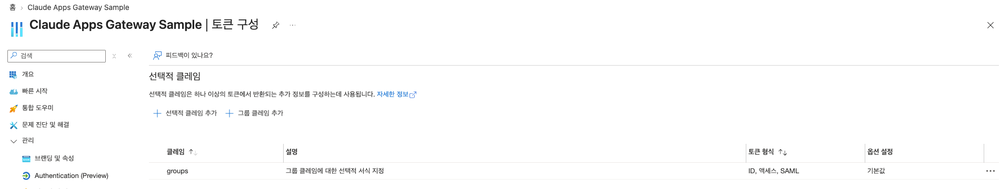
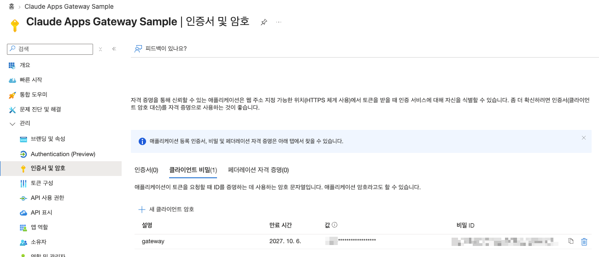
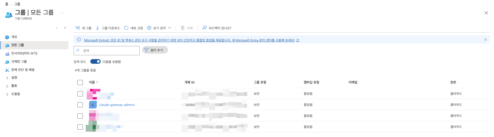
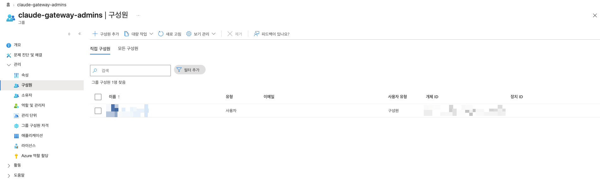
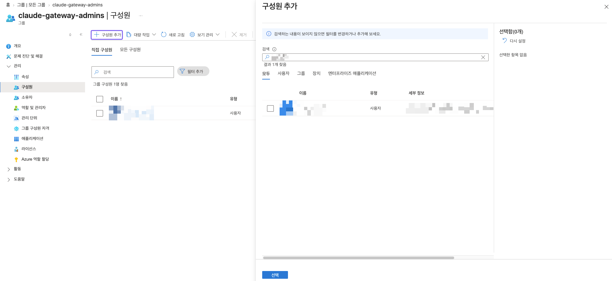

# 1. Entra ID 앱 등록

Claude Apps Gateway용 Entra ID 앱과 Admin Group을 만들고, cdk 배포에 사용할 값을 셸 변수로 확보합니다. \
모든 명령은 Azure CLI(`az`)로 실행합니다.

| 변수 | 내용 | 쓰이는 곳 |
| --- | --- | --- |
| `APP` | 앱(client) ID | CDK 컨텍스트 `oidcClientId` |
| `OBJ` | 앱 object ID | 1.3 group claim 설정 |
| `SECRET` | client secret | CDK 컨텍스트 `oidcClientSecret` |
| `GRP` | Admin Group object ID (GUID) | CDK 컨텍스트 `adminOktaGroupName`, [3단계](03-configure-source.md) |
| `ISSUER` | OIDC issuer (Entra v2) | CDK 컨텍스트 `oidcIssuer` |

## 1.1 로그인

앱 등록·그룹 생성 권한이 있는 계정으로 로그인하고, 테넌트를 확인합니다.

### 로그인 명령어
```bash
az login
```

1. 브라우저에 Microsoft **계정 선택** 화면이 열립니다. 앱 등록 권한이 있는 계정을 고릅니다. \
   브라우저가 열리지 않으면 `az login --use-device-code` 로 다시 실행합니다.

   

2. 터미널로 돌아오면 구독·테넌트 선택 표가 나옵니다. 앱을 등록할 테넌트의 번호를 입력합니다.

### 테넌트 선택 화면 예시
```text
No     Subscription name     Subscription ID                       Tenant
-----  --------------------  ------------------------------------  --------
[1] *  Azure subscription 1  xxxxxxxx-xxxx-xxxx-xxxx-xxxxxxxxxxxx  기본 디렉터리

Select a subscription and tenant (Type a number or Enter for no changes): 1
```

> [!TIP]
> 개인 계정으로 Azure 에 가입하면 `기본 디렉터리` 테넌트가 자동으로 생기고, 가입한 계정이 그 테넌트의 관리자가 됩니다. \
> 구독이 없는 테넌트에는 `az login --allow-no-subscriptions` 로 로그인합니다.

선택한 테넌트와 계정을 확인합니다.

### 테넌트 확인 명령어
```bash
az account show --query "{tenant:tenantId, user:user.name}" -o table
```

### 테넌트 확인 결과 예시
```text
Tenant                                User
------------------------------------  ---------------------
xxxxxxxx-xxxx-xxxx-xxxx-xxxxxxxxxxxx  user@example.com
```

## 1.2 앱 등록

Claude Apps Gateway는 사용자 로그인을 Entra ID 에 맡기므로(OIDC), Entra ID 에 앱으로 등록돼 있어야 합니다. \
client secret 을 쓰는 confidential client 로 앱을 등록하고, 서비스 주체를 만듭니다.

> [!TIP]
> Redirect URI 는 배포 후에 정해지므로 임시값으로 두고 [5.2](05-vpn-and-redirect.md#52-entra-리다이렉트-uri-교체)에서 바꿉니다.

### 앱 등록 명령어
```bash
APP=$(az ad app create --display-name "Claude Apps Gateway" --sign-in-audience AzureADMyOrg --web-redirect-uris "https://placeholder.invalid/oauth/callback" --query appId -o tsv) && echo "APP=$APP"
OBJ=$(az ad app show --id "$APP" --query id -o tsv) && echo "OBJ=$OBJ"
az ad sp create --id "$APP"
```

마지막 명령은 서비스 주체를 JSON 으로 출력합니다. `appId` 가 `APP` 과 같고 `replyUrls` 가 임시값이면 됩니다.

### 앱 등록 결과 예시
값은 가리고 JSON 은 일부만 남겼습니다.

```json
APP=xxxxxxxx-xxxx-xxxx-xxxx-xxxxxxxxxxxx
OBJ=yyyyyyyy-yyyy-yyyy-yyyy-yyyyyyyyyyyy
{
  "@odata.context": "https://graph.microsoft.com/v1.0/$metadata#servicePrincipals/$entity",
  "accountEnabled": true,
  "appDisplayName": "Claude Apps Gateway",
  "appId": "xxxxxxxx-xxxx-xxxx-xxxx-xxxxxxxxxxxx",
  "appOwnerOrganizationId": "<tenant-id>",
  ...
  "id": "<service-principal-id>",
  ...
  "replyUrls": [
    "https://placeholder.invalid/oauth/callback"
  ],
  ...
  "servicePrincipalType": "Application",
  "signInAudience": "AzureADMyOrg",
  ...
}
```

`OBJ`(앱 object ID)와 서비스 주체의 `id` 는 서로 다른 값입니다. 1.3 에는 `OBJ` 를 씁니다.

### 포털에서 확인하는 방법
**Microsoft Entra ID → 관리 → 앱 등록 → 모든 애플리케이션**에 앱이 보입니다. \
같은 이름의 앱이 이미 있으면 `--display-name` 값을 바꿔 구분합니다(아래 화면은 `Claude Apps Gateway Sample` 로 만든 경우).


앱을 열면 **개요**에서 지원되는 계정 유형이 `내 조직만`, 리디렉션 URI 가 `1 웹` 으로 나옵니다.


## 1.3 Group claim(groups) 활성화

Claude Apps Gateway와 관리 콘솔은 로그인 토큰에 담긴 그룹 목록(`groups` claim)으로 관리자를 판단합니다. \
그런데 Entra ID 는 기본값으로 그룹을 토큰에 넣지 않으므로, 넣도록 앱 설정을 바꿉니다.

> [!TIP]
> 해당 과정을 건너뛰면 Admin Group에 넣은 사용자도 관리자로 인식되지 않습니다.

### Group claim 명령어
```bash
az rest --method PATCH --url "https://graph.microsoft.com/v1.0/applications/$OBJ" --body "{\"groupMembershipClaims\": \"SecurityGroup\", \"optionalClaims\": {\"idToken\": [{\"name\": \"groups\", \"essential\": false}], \"accessToken\": [{\"name\": \"groups\", \"essential\": false}]}}"
```

성공하면 아무것도 출력하지 않습니다.

### 포털에서 확인하는 방법
**앱 등록 → (앱) → 관리 → 토큰 구성**의 선택적 클레임 목록에 `groups` 가 보입니다. \
명령 실행 전에 열어 둔 화면이면 새로 고침해야 나타납니다.



> [!IMPORTANT]
> 토큰에 들어가는 값은 그룹 이름(`claude-gateway-admins`)이 아니라 그룹의 **object ID(GUID)** 입니다. \
> 그래서 1.5 에서 그룹 이름이 아니라 GUID 를 `GRP` 로 받아 두고, 3·4단계 설정에도 GUID 를 넣습니다.

<details>
<summary>Claude Apps Gateway의 관리자 판별 방식 (자세히 보기)</summary>

로그인하면 Entra 가 발급하는 토큰(JWT) 안에 사용자 정보가 JSON 으로 들어 있습니다. \
해당 단계를 적용하면 여기에 `groups` claim 이 생기고, 사용자가 속한 보안 그룹의 GUID 가 나열됩니다. \
아래는 JWT에 들어있는 사용자 정보의 예시입니다.

**JWT 사용자 정보 예시**
```json
{
  "email": "sample@example.com",
  "name": "Alice",
  "groups": [
    "1111aaaa-....",
    "2222bbbb-...."
  ]
}
```

위 예시에서 `2222bbbb-....` 가 Admin Group(1.5 단계에서 만드는 그룹)의 GUID 라면 이 사용자는 관리자입니다. \
Claude Apps Gateway와 관리 콘솔은 로그인한 사용자의 `groups` 목록에 Admin Group GUID 가 **있으면 관리자**, **없으면 일반 사용자**로 판단합니다.

비교 기준이 되는 Admin Group GUID는 cdk 배포 전에 각 설정에 넣어 둡니다.

| 구성 요소 | 비교 기준 설정 | 값을 넣는 단계 |
| --- | --- | --- |
| Claude Apps Gateway | `gateway/gateway.yaml` 의 `admin.admin_groups` | [4단계](04-deploy.md) `-c adminOktaGroupName="$GRP"` |
| 관리 콘솔 | `admin-console/app/auth.py` 의 `ADMIN_GROUP_NAME` | [3단계](03-configure-source.md) |

Entra ID는 기본값으로 토큰에 그룹을 넣지 않습니다. 토큰에 `groups` claim 이 아예 없으면 비교할 대상이 없으므로 모든 사용자가 일반 사용자가 됩니다. 이 단계를 건너뛰면 1.5 에서 Admin Group에 넣은 사용자도 [6단계](06-verify.md) 콘솔 사인인에서 비관리자로 표시됩니다.

</details>

<details>
<summary>명령으로 바뀌는 앱 설정</summary>

명령은 앱 매니페스트의 두 값을 바꿉니다. 포털 **앱 등록 → (앱) → 매니페스트**에서 확인할 수 있습니다.

| 설정 | 넣는 값 | 하는 일 |
| --- | --- | --- |
| `groupMembershipClaims` | `"SecurityGroup"` | 사용자가 속한 보안 그룹의 object ID 를 `groups` claim 으로 토큰에 넣습니다. **그룹이 토큰에 들어가게 하는 것은 이 값입니다.** |
| `optionalClaims` 의 `idToken`·`accessToken` | `{"name": "groups"}` | 토큰 종류별 `groups` claim 의 형식을 바꾸는 자리입니다. `additionalProperties` 를 비워 두었으므로 기본 형식(object ID) 그대로입니다. |

포털에서 **앱 등록 → (앱) → 토큰 구성 → 그룹 클레임 추가 → 보안 그룹**을 선택해도 같은 설정이 됩니다.

근거: Microsoft Learn [Configure optional claims](https://learn.microsoft.com/en-us/entra/identity-platform/optional-claims#configure-groups-optional-claims), [Configure group claims for applications](https://learn.microsoft.com/en-us/entra/identity/hybrid/connect/how-to-connect-fed-group-claims)

</details>

## 1.4 client secret 생성

Claude Apps Gateway는 로그인 처리 중 Entra ID 에 토큰을 요청할 때 client secret 으로 자신을 인증합니다(confidential client). \
이 단계에서 secret 을 만들고, 4단계의 `-c oidcClientSecret` 으로 넘깁니다.

> [!TIP]
> secret 은 이때 한 번만 나옵니다. [4.3](04-deploy.md#43-컨텍스트-파일로-저장-선택)에서 파일로 저장합니다.

> [!CAUTION]
> `--append` 를 빼면 이 앱의 기존 자격증명이 전부 삭제됩니다.

### Client Secret 생성 명령어
```bash
SECRET=$(az ad app credential reset --id "$APP" --append --display-name gateway --years 1 --query password -o tsv) && echo "secret 생성됨 (길이 ${#SECRET})"
```

secret 값은 화면에 출력하지 않고 길이만 보여 줍니다.

### Client Secret 생성 결과 예시
```text
WARNING: The output includes credentials that you must protect. Be sure that you do not include these credentials in your code or check the credentials into your source control. For more information, see https://aka.ms/azadsp-cli
secret 생성됨 (길이 40)
```

`WARNING` 은 azure-cli가 secret 을 만들 때마다 띄우는 고정 안내이며 오류가 아닙니다. 마지막 줄에 길이가 나오면 성공입니다. \
secret 은 이 셸의 `$SECRET` 에만 있으므로 4.3 에서 저장할 때까지 셸을 닫지 않습니다.

### 포털에서 확인하는 방법
**앱 등록 → (앱) → 관리 → 인증서 및 암호 → 클라이언트 비밀** 탭에 설명 `gateway`, 만료 1년 뒤인 항목이 보입니다. \
값 열은 앞 3자리만 보이고 전체 값은 다시 볼 수 없습니다.



## 1.5 Admin Group 생성

1.3 에서 설명한 관리자 판별의 기준이 되는 Admin Group을 만들고, 현재 계정을 추가합니다.

> [!TIP]
> 이 그룹의 GUID(`GRP`)를 3·4단계 설정에 넣습니다. 이 그룹에 든 사용자만 관리 콘솔에서 관리자가 됩니다.

### Admin Group 생성 명령어
```bash
GRP=$(az ad group create --display-name "claude-gateway-admins" --mail-nickname "claude-gateway-admins" --query id -o tsv) && az ad group member add --group "$GRP" --member-id "$(az ad signed-in-user show --query id -o tsv)" && echo "GRP=$GRP"
```

### Admin Group 생성 결과 예시
```text
GRP=xxxxxxxx-xxxx-xxxx-xxxx-xxxxxxxxxxxx
```

`GRP=` 뒤에 GUID 가 나오면 성공입니다.

### 포털에서 확인하는 방법
**Microsoft Entra ID → 관리 → 그룹 → 모든 그룹**에 그룹 유형이 `보안` 인 `claude-gateway-admins` 가 보입니다.



그룹을 열고 **관리 → 구성원**에 현재 계정이 보입니다.



<details>
<summary>다른 관리자 추가</summary>

**CLI 로 추가하는 경우**
```bash
az ad group member add --group "$GRP" --member-id "$(az ad user show --id <user@your-domain> --query id -o tsv)"
```

**포털에서 추가하는 경우** \
**그룹 → 모든 그룹 → claude-gateway-admins → 관리 → 구성원 → 구성원 추가**에서 사용자를 검색해 체크하고 **선택**을 누릅니다.



추가한 사용자는 다음 로그인부터 토큰의 `groups` 에 이 그룹이 들어가 관리자가 됩니다.

</details>

## 1.6 issuer 확인

Claude Apps Gateway는 토큰을 발급한 곳(issuer)이 설정된 주소와 같을 때만 토큰을 믿습니다. \
테넌트 ID 로 Entra ID v2 issuer 주소를 만듭니다.

### Issuer 확인 명령어
```bash
ISSUER="https://login.microsoftonline.com/$(az account show --query tenantId -o tsv)/v2.0" && echo "ISSUER=$ISSUER"
```

### Issuer 확인 결과 예시
```text
ISSUER=https://login.microsoftonline.com/xxxxxxxx-xxxx-xxxx-xxxx-xxxxxxxxxxxx/v2.0
```

가운데 GUID 가 1.1 에서 확인한 테넌트 ID 와 같고, 끝이 `/v2.0` 이면 됩니다.

## 1.7 확인

다섯 변수가 모두 채워졌는지 봅니다. secret 은 길이만 출력합니다.

### 변수 확인 명령어
```bash
echo "APP=$APP OBJ=$OBJ GRP=$GRP ISSUER=$ISSUER SECRET_LEN=${#SECRET}"
```

### 변수 확인 결과 예시
```text
APP=xxxxxxxx-xxxx-xxxx-xxxx-xxxxxxxxxxxx OBJ=yyyyyyyy-yyyy-yyyy-yyyy-yyyyyyyyyyyy GRP=zzzzzzzz-zzzz-zzzz-zzzz-zzzzzzzzzzzz ISSUER=https://login.microsoftonline.com/<tenant-id>/v2.0 SECRET_LEN=40
```

| 변수 | 확인할 것 |
| --- | --- |
| `APP` | 1.2 출력의 `APP=` 와 같음 |
| `OBJ` | 1.2 출력의 `OBJ=` 와 같음. `APP` 과는 다른 값 |
| `GRP` | 1.5 출력의 `GRP=` 와 같음 |
| `ISSUER` | 가운데가 1.1 의 테넌트 ID, 끝이 `/v2.0` |
| `SECRET_LEN` | 0 이 아님 (1.4 출력의 길이와 같음) |

하나라도 비어 있으면 셸이 바뀐 것입니다. 해당 단계를 같은 셸에서 다시 실행합니다. 1.4 secret 을 다시 만들면 새 secret 이 추가되므로, 쓰지 않는 secret 은 **인증서 및 암호**에서 지웁니다.

다음: [2. AWS 배포 준비](02-aws-preparation.md)
