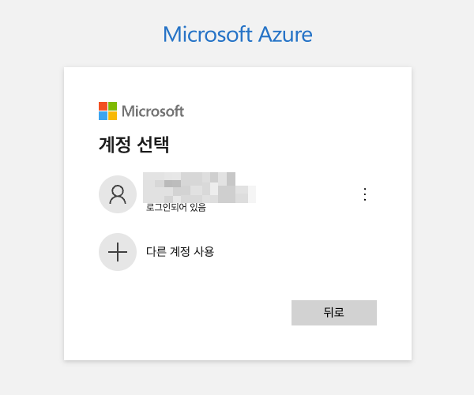
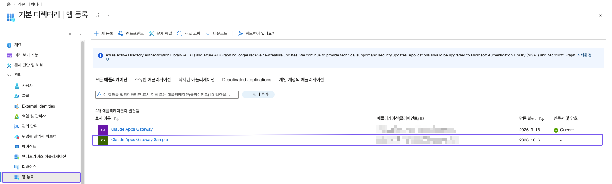
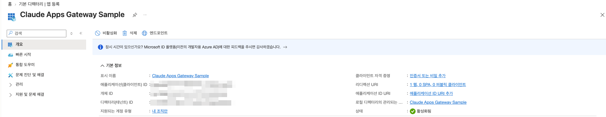

# 1. Entra ID 앱 등록

게이트웨이용 Entra 앱과 어드민 그룹을 만들고, 배포에 쓸 값을 셸 변수로 확보합니다. 모든 명령은 Azure CLI(`az`)로 실행합니다.

| 변수 | 내용 | 쓰이는 곳 |
| --- | --- | --- |
| `APP` | 앱(client) ID | CDK 컨텍스트 `oidcClientId` |
| `OBJ` | 앱 object ID | 1.3 groups 클레임 설정 |
| `SECRET` | client secret | CDK 컨텍스트 `oidcClientSecret` |
| `GRP` | 어드민 그룹 object ID (GUID) | CDK 컨텍스트 `adminOktaGroupName`, [3단계](03-configure-source.md) |
| `ISSUER` | OIDC issuer (Entra v2) | CDK 컨텍스트 `oidcIssuer` |

## 1.1 로그인

앱 등록·그룹 생성 권한이 있는 계정으로 로그인하고, 테넌트를 확인합니다.

```bash
az login
```

1. 브라우저에 Microsoft **계정 선택** 화면이 열립니다. 앱 등록 권한이 있는 계정을 고릅니다. \
   브라우저가 열리지 않으면 `az login --use-device-code` 로 다시 실행합니다.

   

2. 터미널로 돌아오면 구독·테넌트 선택 표가 나옵니다. 앱을 등록할 테넌트의 번호를 입력합니다.

```text
No     Subscription name     Subscription ID                       Tenant
-----  --------------------  ------------------------------------  --------
[1] *  Azure subscription 1  xxxxxxxx-xxxx-xxxx-xxxx-xxxxxxxxxxxx  기본 디렉터리

Select a subscription and tenant (Type a number or Enter for no changes): 1
```

개인 계정으로 Azure 에 가입하면 `기본 디렉터리` 테넌트가 자동으로 생기고, 가입한 계정이 그 테넌트의 관리자가 됩니다. 구독이 없는 테넌트에는 `az login --allow-no-subscriptions` 로 로그인합니다.

선택한 테넌트와 계정을 확인합니다.

```bash
az account show --query "{tenant:tenantId, user:user.name}" -o table
```

```text
Tenant                                User
------------------------------------  ---------------------
xxxxxxxx-xxxx-xxxx-xxxx-xxxxxxxxxxxx  user@example.com
```

## 1.2 앱 등록

게이트웨이는 client secret 을 쓰는 confidential client 입니다. 리다이렉트 URI 는 배포 후에 정해지므로 임시값으로 두고 [5.2](05-vpn-and-redirect.md#52-entra-리다이렉트-uri-교체)에서 바꿉니다.

```bash
APP=$(az ad app create --display-name "Claude Apps Gateway" --sign-in-audience AzureADMyOrg --web-redirect-uris "https://placeholder.invalid/oauth/callback" --query appId -o tsv) && echo "APP=$APP"
OBJ=$(az ad app show --id "$APP" --query id -o tsv) && echo "OBJ=$OBJ"
az ad sp create --id "$APP"
```

마지막 명령은 서비스 주체를 JSON 으로 출력합니다. `appId` 가 `APP` 과 같고 `replyUrls` 가 임시값이면 됩니다. 실행 결과(값은 가리고 JSON 은 일부만):

```text
APP=xxxxxxxx-xxxx-xxxx-xxxx-xxxxxxxxxxxx
OBJ=yyyyyyyy-yyyy-yyyy-yyyy-yyyyyyyyyyyy
{
  "@odata.context": "https://graph.microsoft.com/v1.0/$metadata#servicePrincipals/$entity",
  "accountEnabled": true,
  "appDisplayName": "Claude Apps Gateway",
  "appId": "xxxxxxxx-xxxx-xxxx-xxxx-xxxxxxxxxxxx",
  "appOwnerOrganizationId": "<tenant-id>",
  ...
  "id": "<service-principal-id>",
  ...
  "replyUrls": [
    "https://placeholder.invalid/oauth/callback"
  ],
  ...
  "servicePrincipalType": "Application",
  "signInAudience": "AzureADMyOrg",
  ...
}
```

`OBJ`(앱 object ID)와 서비스 주체의 `id` 는 서로 다른 값입니다. 1.3 에는 `OBJ` 를 씁니다.

포털 **Microsoft Entra ID → 관리 → 앱 등록 → 모든 애플리케이션**에도 앱이 보입니다. \
같은 이름의 앱이 이미 있으면 `--display-name` 을 바꿔 구분합니다(아래 화면은 `Claude Apps Gateway Sample` 로 만든 경우).



앱을 열면 **개요**에서 지원되는 계정 유형이 `내 조직만`, 리디렉션 URI 가 `1 웹` 으로 나옵니다.



## 1.3 groups 클레임 활성화

Entra 는 그룹을 optional claim 으로 토큰에 담고, 값은 그룹 이름이 아니라 **object ID(GUID)** 입니다.

```bash
az rest --method PATCH --url "https://graph.microsoft.com/v1.0/applications/$OBJ" --body "{\"groupMembershipClaims\": \"SecurityGroup\", \"optionalClaims\": {\"idToken\": [{\"name\": \"groups\", \"essential\": false}], \"accessToken\": [{\"name\": \"groups\", \"essential\": false}]}}"
```

## 1.4 client secret 생성

> [!CAUTION]
> `--append` 를 빼면 이 앱의 기존 자격증명이 전부 삭제됩니다.

secret 은 이때 한 번만 나옵니다. [4.3](04-deploy.md#43-컨텍스트-파일로-저장-선택)에서 파일로 저장합니다.

```bash
SECRET=$(az ad app credential reset --id "$APP" --append --display-name gateway --years 1 --query password -o tsv) && echo "secret 생성됨 (길이 ${#SECRET})"
```

## 1.5 어드민 그룹 생성

관리 콘솔 관리자를 넣을 그룹을 만들고, 현재 계정을 추가합니다.

```bash
GRP=$(az ad group create --display-name "claude-gateway-admins" --mail-nickname "claude-gateway-admins" --query id -o tsv) && az ad group member add --group "$GRP" --member-id "$(az ad signed-in-user show --query id -o tsv)" && echo "GRP=$GRP"
```

다른 관리자 추가:

```bash
az ad group member add --group "$GRP" --member-id "$(az ad user show --id <user@your-domain> --query id -o tsv)"
```

## 1.6 issuer 확인

```bash
ISSUER="https://login.microsoftonline.com/$(az account show --query tenantId -o tsv)/v2.0" && echo "ISSUER=$ISSUER"
```

## 1.7 확인

다섯 변수가 모두 채워졌는지 봅니다. secret 은 길이만 출력합니다.

```bash
echo "APP=$APP OBJ=$OBJ GRP=$GRP ISSUER=$ISSUER SECRET_LEN=${#SECRET}"
```

다음: [2. AWS 배포 준비](02-aws-preparation.md)
