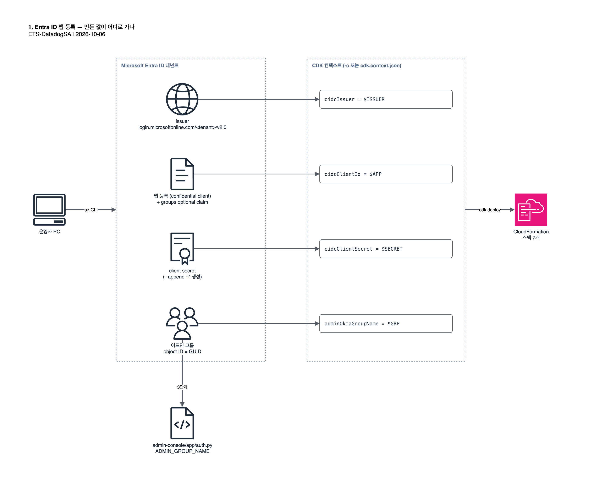

# 1. Entra ID 앱 등록

게이트웨이가 쓸 Entra 앱과 어드민 그룹을 만들고, CDK 배포에 넘길 값 네 개(`APP`, `SECRET`, `GRP`, `ISSUER`)를
셸 변수로 확보합니다. 모든 명령은 Azure CLI(`az`)로 실행합니다.



| 변수 | 내용 | 쓰이는 곳 |
| --- | --- | --- |
| `APP` | 앱(client) ID | CDK 컨텍스트 `oidcClientId` |
| `OBJ` | 앱 object ID | 이 문서의 groups 클레임 설정 |
| `SECRET` | client secret | CDK 컨텍스트 `oidcClientSecret` |
| `GRP` | 어드민 그룹 object ID (GUID) | CDK 컨텍스트 `adminOktaGroupName`, [3단계](03-configure-source.md) |
| `ISSUER` | OIDC issuer (Entra v2) | CDK 컨텍스트 `oidcIssuer` |

## 1.1 로그인

앱 등록과 그룹 생성이 가능한 계정으로 로그인하고, 대상 테넌트가 맞는지 확인합니다.

```bash
az login
```

```bash
az account show --query "{tenant:tenantId, user:user.name}" -o table
```

## 1.2 앱 등록

게이트웨이는 client secret 을 쓰는 **confidential client** 입니다. 리다이렉트 URI 는 게이트웨이 주소가 배포 후에야
정해지므로 임시값으로 두고 [5단계](05-vpn-and-redirect.md#52-entra-리다이렉트-uri-교체)에서 바꿉니다.

```bash
APP=$(az ad app create --display-name "Claude Apps Gateway" --sign-in-audience AzureADMyOrg --web-redirect-uris "https://placeholder.invalid/oauth/callback" --query appId -o tsv) && echo "APP=$APP"
```

```bash
OBJ=$(az ad app show --id "$APP" --query id -o tsv) && echo "OBJ=$OBJ"
```

```bash
az ad sp create --id "$APP"
```

## 1.3 groups 클레임 활성화

Entra 에는 Okta 의 `groups` 스코프가 없습니다. 그룹은 optional claim 으로 토큰에 실리고, 값은 그룹 이름이 아니라
**object ID(GUID)** 입니다.

```bash
az rest --method PATCH --url "https://graph.microsoft.com/v1.0/applications/$OBJ" --body "{\"groupMembershipClaims\": \"SecurityGroup\", \"optionalClaims\": {\"idToken\": [{\"name\": \"groups\", \"essential\": false}], \"accessToken\": [{\"name\": \"groups\", \"essential\": false}]}}"
```

## 1.4 client secret 생성

> [!CAUTION]
> `--append` 를 빼면 이 앱의 기존 자격증명이 전부 삭제됩니다.

secret 값은 이때 한 번만 나오므로 셸 변수에 담아 두고, [4단계](04-deploy.md#43-컨텍스트-파일로-저장-선택)에서 파일로
저장합니다.

```bash
SECRET=$(az ad app credential reset --id "$APP" --append --display-name gateway --years 1 --query password -o tsv) && echo "secret 생성됨 (길이 ${#SECRET})"
```

## 1.5 어드민 그룹 생성

관리 콘솔에서 비용 한도와 모델 접근을 관리할 사람을 이 그룹에 넣습니다. 아래 명령은 그룹을 만들고 현재 로그인한
계정을 추가합니다.

```bash
GRP=$(az ad group create --display-name "claude-gateway-admins" --mail-nickname "claude-gateway-admins" --query id -o tsv) && az ad group member add --group "$GRP" --member-id "$(az ad signed-in-user show --query id -o tsv)" && echo "GRP=$GRP"
```

다른 관리자는 같은 방식으로 추가합니다.

```bash
az ad group member add --group "$GRP" --member-id "$(az ad user show --id <user@your-domain> --query id -o tsv)"
```

## 1.6 issuer 확인

Entra v2 엔드포인트의 issuer 를 씁니다.

```bash
ISSUER="https://login.microsoftonline.com/$(az account show --query tenantId -o tsv)/v2.0" && echo "ISSUER=$ISSUER"
```

## 1.7 확인

다섯 변수가 모두 채워졌는지 확인합니다. secret 은 길이만 출력합니다.

```bash
echo "APP=$APP OBJ=$OBJ GRP=$GRP ISSUER=$ISSUER SECRET_LEN=${#SECRET}"
```

다음: [2. AWS 배포 준비](02-aws-preparation.md)
