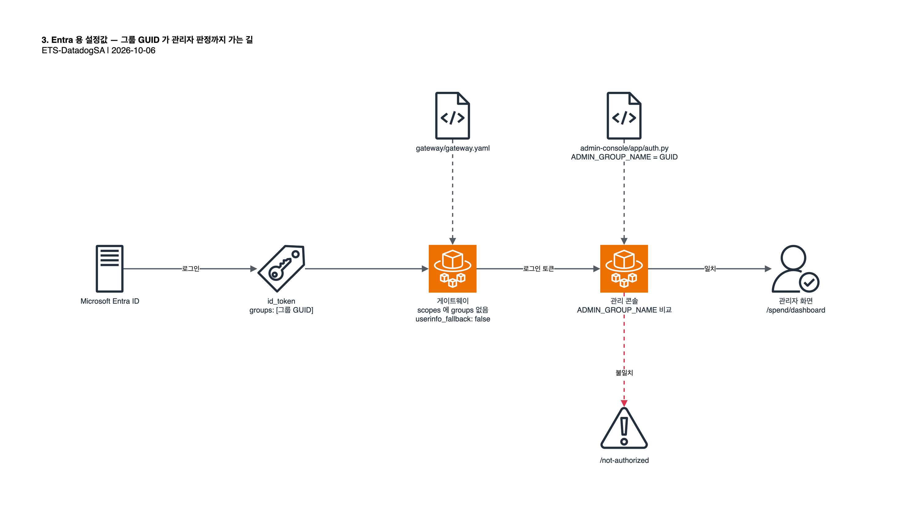

# 3. Entra 용 설정값 반영

원본 리포는 Okta 기준으로 짜여 있어 설정값 세 곳이 Entra 와 맞지 않습니다. 이 리포는 그중 두 곳을 이미 Entra
값으로 바꿔 두었고, 테넌트마다 다른 어드민 그룹 GUID 한 곳만 배포 전에 채우면 됩니다. 리포 루트에서
실행합니다(macOS `sed` 기준).



| 위치 | 원본 값 | 이 리포 값 | 이유 |
| --- | --- | --- | --- |
| `gateway/gateway.yaml` `oidc.userinfo_fallback` | `true` | `false` (반영됨) | Okta org 서버의 thin id_token 대응용. Entra 의 userinfo 는 groups 를 주지 않음 |
| `gateway/gateway.yaml` `oidc.scopes` | `groups` 포함 | `groups` 제거 (반영됨) | Entra 에 `groups` 스코프가 없음. 그룹은 optional claim 으로 옴([1.3](01-entra-id.md#13-groups-클레임-활성화)) |
| `admin-console/app/auth.py` `ADMIN_GROUP_NAME` | `"claude-gateway-admins"` | `"<ENTRA_ADMIN_GROUP_OBJECT_ID>"` → **`$GRP` 로 교체 필요** | 콘솔이 그룹명을 하드코딩해 비교하는데, Entra 는 GUID 를 내보냄 |

Anthropic 공식 문서는 Entra 로 갈 때 `userinfo_fallback` 과 `groups` 스코프를 **함께** 제거하라고 안내합니다.
이 리포는 키를 지우는 대신 `false` 로 명시했습니다. 생략했을 때의 기본값을 확인할 수 없기 때문입니다.

## 3.1 관리 콘솔의 어드민 그룹 지정

[1.5](01-entra-id.md#15-어드민-그룹-생성)에서 만든 그룹의 object ID 를 넣습니다.

```bash
sed -i '' "s/<ENTRA_ADMIN_GROUP_OBJECT_ID>/$GRP/" admin-console/app/auth.py && grep -n "^ADMIN_GROUP_NAME" admin-console/app/auth.py
```

이 값은 CDK 컨텍스트로 넘기는 `adminOktaGroupName` 과 별개입니다. 컨텍스트 값은 게이트웨이 컨테이너의 환경변수로만
전달되고 관리 콘솔 컨테이너에는 주입되지 않습니다. 그래서 콘솔 쪽은 소스에서 직접 맞춰야 합니다. Okta 에서도 기본값과
다른 그룹명을 쓰면 같은 문제가 생깁니다.

자리표시자를 그대로 두고 배포해도 배포는 성공합니다. 다만 어떤 관리자도 콘솔에서 관리자 권한을 받지 못합니다.

## 3.2 확인

세 값을 한 번에 확인합니다.

```bash
grep -n "userinfo_fallback:\|^  scopes:" gateway/gateway.yaml && grep -n "^ADMIN_GROUP_NAME" admin-console/app/auth.py
```

기대 출력은 다음과 같습니다.

```
userinfo_fallback: false
scopes: [openid, profile, email, offline_access]
ADMIN_GROUP_NAME = "<GRP 의 GUID>"
```

`auth.py` 의 GUID 는 테넌트 고유값입니다. 이 리포에 커밋하지 않습니다. 커밋 전에 되돌리려면 다음을 실행합니다.

```bash
git checkout -- admin-console/app/auth.py
```

> App Roles 를 쓰는 방법도 있습니다. Entra 앱에 App Role 을 정의하고 `gateway.yaml` 에 `oidc.groups_claim: roles`
> 를 두면 claim 에 GUID 가 아닌 role 값이 들어옵니다. role 이름을 고정값으로 정하면 `auth.py` 를 배포마다 고치지
> 않아도 될 수 있으나, 이 가이드에서는 검증하지 않았습니다.

다음: [4. CDK 배포](04-deploy.md)
