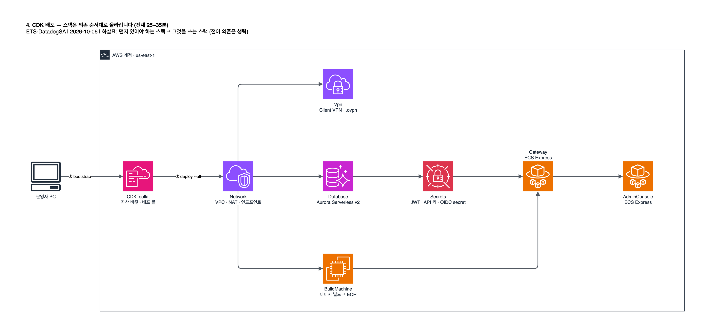

# 4. CDK 배포

[1단계](01-entra-id.md)에서 만든 값으로 bootstrap 하고 스택 7개를 배포합니다. 여기부터는 `cdk/` 에서 실행합니다.



```bash
cd cdk
```

모든 CDK 명령에 컨텍스트 네 개를 넘깁니다.

| 컨텍스트 키 | 셸 변수 | 비고 |
| --- | --- | --- |
| `oidcIssuer` | `$ISSUER` | 필수 |
| `oidcClientId` | `$APP` | 필수 |
| `oidcClientSecret` | `$SECRET` | 필수 |
| `adminOktaGroupName` | `$GRP` | 이름은 Okta 지만 그룹 GUID 를 넣음. 빠지면 `claude-gateway-admins` |

## 4.1 bootstrap

계정·리전당 한 번입니다. bootstrap 에도 컨텍스트가 필요합니다(없으면 `Missing required context values`).

```bash
npx cdk bootstrap "aws://$(aws sts get-caller-identity --query Account --output text)/us-east-1" -c oidcIssuer="$ISSUER" -c oidcClientId="$APP" -c oidcClientSecret="$SECRET" -c adminOktaGroupName="$GRP"
```

`CDKToolkit` 이 `ROLLBACK_COMPLETE` 로 남으면 `iam:CreateRole` 권한 문제입니다. → [10장](10-troubleshooting.md)

## 4.2 배포

```bash
npx cdk deploy --all -c oidcIssuer="$ISSUER" -c oidcClientId="$APP" -c oidcClientSecret="$SECRET" -c adminOktaGroupName="$GRP"
```

- 25~35분 걸립니다. 대부분 Aurora 생성, 이미지 빌드, 로드밸런서 생성 시간입니다.
- IAM 변경 승인을 한 번 묻습니다. `--require-approval never` 로 생략할 수 있습니다.
- 중간에 자격증명이 만료돼도 CloudFormation 은 계속 진행됩니다. 다시 인증하고 같은 명령을 실행합니다.

> [!WARNING]
> `oidcClientSecret` 은 `cdk.context.json` 과 `cdk.out/` 템플릿에 평문으로 남고, CloudFormation 콘솔에서도 보입니다. 운영에서는 Secrets Manager 에 따로 만들고 ARN 으로 참조합니다.

<details>
<summary>client secret 을 빈 값으로 둘 수 없는 이유</summary>

게이트웨이는 부팅 때 설정 전체를 검증하고 `client_secret` 을 필수로 봅니다. 원본의 이전 설계는 빈 값으로 배포한 뒤 나중에 채웠는데, 게이트웨이가 크래시루프에 빠지고 ECS Express Mode 가 포기하면 CloudFormation 이 스택을 롤백해 고칠 기회가 없었습니다. secret 이 평문으로 남는 것은 원본 코드가 `SecretValue.unsafePlainText` 로 넘기기 때문입니다.
</details>

## 4.3 컨텍스트 파일로 저장 (선택)

`cdk.context.json` 에 저장하면 이후 `bootstrap`·`deploy`·`destroy` 에서 `-c` 를 생략할 수 있습니다.

```bash
jq -n --arg i "$ISSUER" --arg a "$APP" --arg s "$SECRET" --arg g "$GRP" '{oidcIssuer:$i, oidcClientId:$a, oidcClientSecret:$s, adminOktaGroupName:$g}' > cdk.context.json && chmod 600 cdk.context.json
```

secret 이 평문으로 들어가므로 파일 관리에 주의합니다(`.gitignore` 대상). Windows 에서는 `chmod 600` 이 효과가 없습니다.

## 4.4 출력값 기록

배포가 끝나면 두 주소가 출력됩니다.

```
ClaudeGatewayStack.GatewayEndpoint                  = https://cl-xxxx.ecs.us-east-1.on.aws
ClaudeGatewayAdminConsoleStack.AdminConsoleEndpoint = https://cl-yyyy.ecs.us-east-1.on.aws
```

다시 조회할 때:

```bash
GWEP=$(aws cloudformation describe-stacks --stack-name ClaudeGatewayStack --query "Stacks[0].Outputs[?OutputKey=='GatewayEndpoint'].OutputValue" --output text) && echo "GWEP=$GWEP"
aws cloudformation describe-stacks --stack-name ClaudeGatewayAdminConsoleStack --query "Stacks[0].Outputs[?OutputKey=='AdminConsoleEndpoint'].OutputValue" --output text
```

<details>
<summary>주소를 서비스에 따로 넣지 않아도 되는 이유</summary>

호스트명은 ECS Express Mode 가 만들어 배포 전에는 알 수 없습니다. 두 스택의 URL fixer Custom Resource 가 각 서비스의 `*_PUBLIC_URL` 환경변수를 실제 값으로 자동으로 고쳐 넣습니다.
</details>

## 4.5 새 셸에서 변수 복원

[4.3](#43-컨텍스트-파일로-저장-선택)의 파일이 있으면 `cdk/` 에서 다시 읽습니다.

```bash
eval "$(jq -r '"export ISSUER=\(.oidcIssuer|@sh) APP=\(.oidcClientId|@sh) SECRET=\(.oidcClientSecret|@sh) GRP=\(.adminOktaGroupName|@sh)"' cdk.context.json)" && echo "APP=$APP GRP=$GRP ISSUER=$ISSUER SECRET_LEN=${#SECRET}"
```

리전·자격증명 환경변수([2.3](02-aws-preparation.md#23-리전과-자격증명-고정))도 다시 설정합니다. 파일이 없으면 secret 을 다시 조회할 방법이 없으므로 [1.4](01-entra-id.md#14-client-secret-생성)로 새로 만듭니다.

다음: [5. VPN 연결과 리다이렉트 URI](05-vpn-and-redirect.md)
