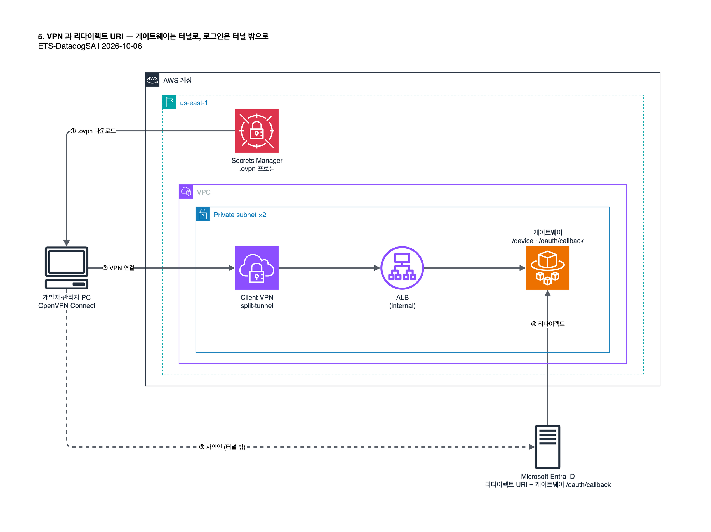

# 5. VPN 연결과 리다이렉트 URI

사인인 전에 VPN 을 연결하고, Entra 리다이렉트 URI 를 실제 주소로 바꿉니다. `cdk/` 에서 실행합니다.



## 5.1 VPN 연결

VPN 프로필을 Secrets Manager 에서 받습니다.

```bash
aws secretsmanager get-secret-value --secret-id "$(aws cloudformation describe-stacks --stack-name ClaudeGatewayVpnStack --query "Stacks[0].Outputs[?OutputKey=='VpnClientProfileSecretArn'].OutputValue" --output text)" --query SecretString --output text | jq -r .ovpnProfile > claude-gateway-vpn-client.ovpn
```

1. [OpenVPN Connect](https://openvpn.net/client/) 를 설치합니다.
2. 프로필 가져오기(Import Profile)로 `claude-gateway-vpn-client.ovpn` 을 불러옵니다.
3. 프로필을 켜서 연결합니다.

> [!IMPORTANT]
> 관리자도 VPN 이 필요합니다. 관리 콘솔 사인인 중 브라우저가 게이트웨이의 `/device` 페이지로 이동하기 때문입니다. VPN 없이 사인인하면 오류 없이 무한 대기합니다.

`.ovpn` 에는 클라이언트 인증서와 키가 들어 있으니 커밋하지 않습니다. 같은 파일을 [AWS VPN Client](https://docs.aws.amazon.com/vpn/latest/clientvpn-user/user-getting-started.html) 등 다른 OpenVPN 클라이언트로 불러와도 됩니다.

<details>
<summary>split-tunnel 인 이유</summary>

VPC 로 가는 트래픽만 터널을 타고, 브라우저의 Entra 로그인은 터널 밖으로 나갑니다. full-tunnel 로 바꾸면 Entra 로그인이 터널 안에서 막혀 사인인이 오류 없이 멈춥니다.
</details>

## 5.2 Entra 리다이렉트 URI 교체

[1.2](01-entra-id.md#12-앱-등록)의 임시값을 게이트웨이 주소로 바꿉니다. 건너뛰면 로그인 끝에서 `AADSTS50011` 로 거부됩니다.

```bash
GWEP=$(aws cloudformation describe-stacks --stack-name ClaudeGatewayStack --query "Stacks[0].Outputs[?OutputKey=='GatewayEndpoint'].OutputValue" --output text) && az ad app update --id "$APP" --web-redirect-uris "$GWEP/oauth/callback" && echo "$GWEP/oauth/callback"
```

## 5.3 헬스체크

VPN 연결 상태에서 실행합니다.

```bash
curl -s "$GWEP/healthz"
```

다음: [6. 배포 확인](06-verify.md)
