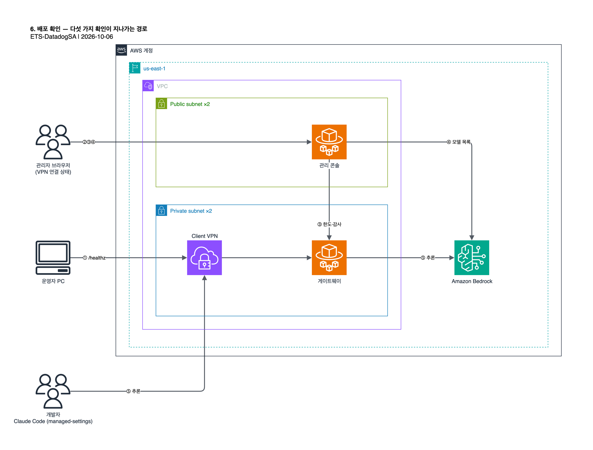

# 6. 배포 확인

아래 다섯 항목이 모두 통과하면 인증, 비용 한도 관리, 모델 접근 관리, Bedrock 추론까지 확인된 것입니다. 모두 VPN 을
연결한 상태에서 진행합니다. 세부 화면은 원본 문서 [03-verify.md](original/03-verify.md) 와 [04-admin-console-guide.md](original/04-admin-console-guide.md) 를
참고합니다.



| 확인 | 방법 | 기대 결과 |
| --- | --- | --- |
| 게이트웨이 헬스 | `curl -s "$GWEP/healthz"` | `{"status":"ok"}` 류의 응답 |
| 관리 콘솔 사인인 | 브라우저로 `<AdminConsoleEndpoint>/signin` | Entra 로그인 후 `/spend/dashboard` 도착 |
| 비용 한도 | 콘솔 Limits 에서 테스트 한도 생성, Audit 확인 | actor 가 `oidc:<로그인한 관리자>` |
| 모델 접근 | 콘솔 Models | Bedrock Anthropic 모델 목록, 기본 3종 활성 |
| 실제 추론 | Claude Code 로 게이트웨이 로그인 후 프롬프트 1회 | 응답 완료, Audit 에 추론 기록 |

## 6.1 게이트웨이 헬스

```bash
curl -s "$GWEP/healthz"
```

실패하면 CloudWatch Logs 의 게이트웨이 로그 그룹에서 부팅 순서(설정 로드 → DB 마이그레이션 →
`claude gateway listening`)를 확인합니다.

## 6.2 관리 콘솔 사인인

1. 브라우저로 `<AdminConsoleEndpoint>/signin` 을 엽니다.
2. device 인증 흐름을 따라 Entra 로그인 페이지로 넘어갑니다.
3. [1.5](01-entra-id.md#15-어드민-그룹-생성)의 어드민 그룹에 속한 계정으로 로그인합니다.
4. `/spend/dashboard` 에 도착하면 성공입니다.

`/not-authorized` 로 가면 그룹 정보가 콘솔까지 오지 않은 것입니다.
[10. 문제 해결](10-troubleshooting.md#사인인은-되는데-not-authorized)을 따릅니다.

## 6.3 비용 한도와 감사 로그

콘솔의 Limits(`/spend/limits`)에서 테스트용 조직 한도(예: 월 $10)를 만들고 목록에 나타나는지 확인합니다. Audit
(`/spend/audit`)에서 해당 항목의 actor 가 공용 자격증명이 아니라 로그인한 관리자 본인(`oidc:<subject>`)인지
확인합니다. 콘솔이 공용 자격증명이 아니라 사인인한 관리자 본인의 ID 로 이 쓰기를 했다는 뜻입니다. 확인이 끝나면 테스트
한도를 지웁니다.

감사 로그는 게이트웨이에 직접 물어볼 수도 있습니다. 관리자의 게이트웨이 토큰이 필요합니다.

```bash
curl -s -H "Authorization: Bearer <관리자의 게이트웨이 토큰>" "$GWEP/v1/organizations/audit_log?limit=5"
```

## 6.4 모델 접근

콘솔의 Models(`/models`)에서 리전의 Bedrock Anthropic 모델 목록이 보이고, 새로 배포한 직후에는 기본 3종(Opus,
Sonnet, Haiku)이 활성인지 확인합니다.

## 6.5 실제 추론

Claude Code 는 게이트웨이 주소를 **managed settings** 에서만 읽습니다. 개인 `~/.claude/settings.json` 에 넣으면
적용되지 않습니다. macOS 의 시스템 경로는 `/Library/Application Support/ClaudeCode/managed-settings.json` 이며
`sudo` 로 씁니다.

```json
{
  "forceLoginMethod": "gateway",
  "forceLoginGatewayUrl": "https://<GatewayEndpoint>"
}
```

사용자 경로(`~/Library/Application Support/ClaudeCode/managed-settings.json`)에도 파일이 있다면 시스템 경로가
우선합니다.

1. VPN 을 연결한 채 새 터미널에서 `claude` 를 실행합니다.
2. "Trust gateway" 프롬프트에 방금 배포한 게이트웨이 호스트명이 보이는지 확인합니다.
3. device 인증을 승인하고 간단한 프롬프트를 실행합니다.
4. 콘솔 Audit 에 사용한 모델과 사용자 정보가 담긴 추론 기록이 남는지 확인합니다.

다음: [7. 관리 콘솔 사용법](07-admin-console.md)
