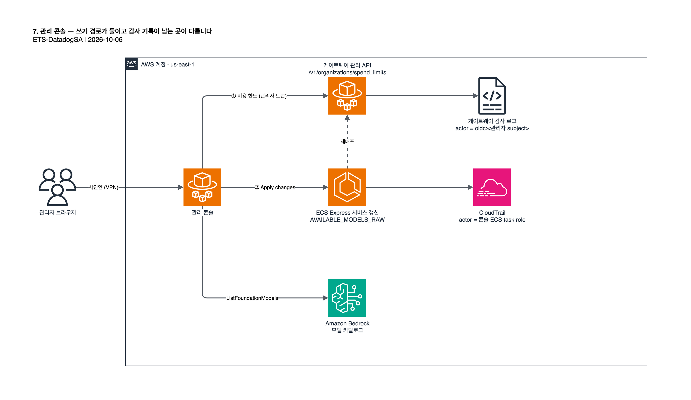

# 7. 관리 콘솔 사용법

관리 콘솔의 세 기능(사용액 대시보드, 비용 한도, 모델 접근)과, 기능마다 감사 기록이 남는 곳이 다르다는 점을 다룹니다. 원본은 [original/04-admin-console-guide.md](original/04-admin-console-guide.md) 입니다.

| 기능 | 경로 | 실제 동작 | 기록이 남는 곳 |
| --- | --- | --- | --- |
| 사용액 대시보드 | `/spend/dashboard` | 게이트웨이 `/v1/organizations/effective` 조회 | (읽기) |
| 비용 한도 | `/spend/limits` | 게이트웨이 관리 API `/v1/organizations/spend_limits` 호출 | 게이트웨이 감사 로그, 관리자 본인 |
| 모델 접근 | `/models` | 콘솔 IAM 롤이 `ecs:UpdateExpressGatewayService` 호출 | CloudTrail, 콘솔 ECS task role |

## 7.1 사용액 대시보드와 비용 한도

- **대시보드**: 기간별 실사용액을 조직·RBAC 그룹·사용자 단위로 봅니다.
- **한도**: 조직·RBAC 그룹·사용자 단위로 금액과 기간(`daily`, `weekly`, `monthly`)을 정합니다. 만들고, 보고, 지울 수 있습니다.

한도 변경은 사인인한 관리자 본인의 게이트웨이 토큰으로 관리 API 를 호출합니다.

- 감사 로그의 행위자는 `oidc:<관리자의 Entra subject>` 입니다.
- 관리자를 Entra 어드민 그룹에서 빼면 다음 확인 시점부터 그 세션은 한도를 바꿀 수 없습니다. 따로 회수할 자격증명이 없습니다.

관리자 토큰은 어떻게 받나

Claude Code CLI 가 개발자를 사인인시킬 때와 같은 device 인증 흐름으로 게이트웨이가 발급합니다. 콘솔은 고정된 관리자 자격증명을 들고 있지 않습니다.

## 7.2 모델 접근

Models(`/models`)는 배포 리전 Bedrock 의 Anthropic 모델 카탈로그를 실시간으로 보여 주고, 각 모델이 켜져 있는지 표시합니다. 처음에는 `claude-opus-4-8`, `claude-sonnet-4-6`, `claude-haiku-4-5` 가 켜져 있습니다(`cdk/lib/gateway-stack.ts` 기본값).

1. 열어 줄 모델을 고릅니다.
2. **Apply changes** 를 누릅니다.
3. "Applying..." 이 "Active" 로 바뀔 때까지 기다립니다. 보통 2분 안쪽입니다.

> [!NOTE]
> 적용하면 게이트웨이가 새 ECS 태스크로 다시 뜹니다. 여러 모델을 한 번에 골라 적용하면 재배포가 한 번으로 끝납니다.

재빌드 없이 모델 목록이 바뀌는 방식

`gateway.yaml` 은 환경변수로 YAML 목록을 채우지 못합니다(스칼라 `${VAR}` 치환만 지원). 그래서 `gateway/entrypoint.sh` 가 게이트웨이 시작 전에 환경변수 `AVAILABLE_MODELS_RAW` 를 `availableModels` 목록으로 펼칩니다. 덕분에 모델 목록 변경은 같은 이미지에 환경변수만 바꾸는 ECS 갱신(`ecs:UpdateExpressGatewayService`)이 되고, 재빌드나 파이프라인이 필요 없습니다.

### 비용 한도와 다른 감사 방식

> [!WARNING]
> 모델 접근 변경은 게이트웨이 감사 로그에 **남지 않습니다**. CloudTrail 에 남지만 행위자는 버튼을 누른 관리자가 아니라 콘솔의 ECS task role 입니다. 관리자별 기록이 필요하면 콘솔에 애플리케이션 로그를 추가해야 합니다(이 구현에는 없음).

이렇게 설계한 이유

게이트웨이에는 모델 허용 목록을 바꾸는 런타임 API 가 없습니다. 인프라 변경에 가까운 작업을 위해 새 관리 API 를 여는 대신, 콘솔의 IAM 권한을 게이트웨이 서비스 하나에 대한 ECS 작업으로 좁게 유지한 절충입니다(`cdk/lib/admin-console-stack.ts` 의 task role 정책).

다음: [8. 커스텀 추론 프로파일 (선택)](08-custom-inference-profile.md)
