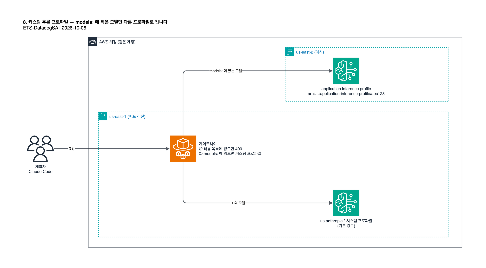

# 8. 커스텀 추론 프로파일 (선택)

기본 설정에서는 모든 모델이 `gateway/gateway.yaml` 의 `auto_include_builtin_models: true` 가 자동으로 붙여 주는 기본
크로스리전 추론 프로파일(`us.anthropic.*`)로 갑니다. 이 문서는 선택 사항인 다른 경우, 즉 특정 모델을 **커스텀 Bedrock 추론
프로파일**로 보내는 방법을 다룹니다. 원본은 [original/06-custom-inference-profile.md](original/06-custom-inference-profile.md) 입니다.



가장 흔한 대상은 비용 배분·추적용으로 만든
[application inference profile](https://docs.aws.amazon.com/bedrock/latest/userguide/cross-region-inference-profiles-support.html),
프로비저닝된 처리량 할당분, 또는 프로파일에 붙인 가드레일입니다.

원하는 만큼 모델을 이렇게 보낼 수 있습니다. 모델마다 독립된 항목이고, 각각 다른 프로파일을 가리킬 수 있습니다. 명시하지
않은 모델은 기본 `us.anthropic.*` 프로파일을 그대로 씁니다.

> 이 방법은 us-east-1 이 아닌 리전에 배포할 때도 쓸 수 있습니다. 게이트웨이의 IAM 정책은 같은 계정의 application
> inference profile 을 리전과 관계없이 이미 허용하기 때문입니다(8.3). 반면 `global.anthropic.*` 같은 **시스템** 추론
> 프로파일은 허용 범위에 없어 IAM 을 따로 고쳐야 합니다.

## 8.1 시작 전에 필요한 것

- 커스텀 추론 프로파일의 전체 ARN. 예: `arn:aws:bedrock:us-east-2:111111111111:application-inference-profile/abc123`.
  Bedrock 콘솔(**Inference and Assessment → Cross-region inference** 또는 **Application inference profiles**)이나
  `aws bedrock list-inference-profiles` / `aws bedrock list-application-inference-profiles` 로 확인합니다.
- 그 프로파일로 보낼 **게이트웨이 기준 모델 ID**. 예: `claude-sonnet-5`, `claude-opus-4-8`, `claude-haiku-4-5`.
  게이트웨이와 관리 콘솔의 모델 접근 화면이 함께 쓰는 짧은 ID 이고, 이미 켜져 있는 모델이라면 `AVAILABLE_MODELS_RAW`
  (`cdk/lib/gateway-stack.ts`)에 보이는 값입니다.
- 프로파일이 있는 리전에서 해당 모델의 [모델 액세스](https://docs.aws.amazon.com/bedrock/latest/userguide/model-access.html)가 확인돼 있어야 합니다.

프로파일은 이 스택을 배포한 리전과 다른 리전에 있어도 됩니다. Bedrock 은 다른 리전으로 설정된 클라이언트에서 프로파일 ARN
을 호출하는 것을 허용합니다.

## 8.2 `gateway/gateway.yaml` 에 모델 추가

`gateway/gateway.yaml` 에서 `auto_include_builtin_models: true` 바로 아래의 주석 처리된 `models:` 예시를 찾아 주석을
풀고 값을 채웁니다.

```yaml
auto_include_builtin_models: true

models:
  - id: claude-sonnet-5
    label: Claude Sonnet 5 (custom inference profile)
    upstream_model:
      bedrock: arn:aws:bedrock:us-east-2:111111111111:application-inference-profile/abc123
```

두 번째 모델을 다른 프로파일로 보내려면 항목을 하나 더 추가합니다.

```yaml
models:
  - id: claude-sonnet-5
    label: Claude Sonnet 5 (custom inference profile)
    upstream_model:
      bedrock: arn:aws:bedrock:us-east-2:111111111111:application-inference-profile/abc123
  - id: claude-opus-4-8
    label: Claude Opus 4.8 (custom inference profile)
    upstream_model:
      bedrock: arn:aws:bedrock:us-east-2:111111111111:application-inference-profile/def456
```

문법 주의점은 다음과 같습니다.

- `upstream_model` 의 키(두 예시 모두 `bedrock:`)는 위쪽 `upstreams:` 항목의 `name:` 과 같아야 합니다. 이 리포의 기본
  `upstreams:` 항목에는 `name:` 이 없어서 provider 문자열인 `bedrock` 이 기본 이름입니다. 그 upstream 에 `name:` 을
  따로 붙이지 않았다면 키는 `bedrock` 으로 둡니다.
- `id:` 는 개발자와 관리 콘솔이 쓰는 게이트웨이 기준 모델 ID 입니다. ARN 의 어느 부분과도 맞출 필요가 없습니다.
- 이 블록은 순수 YAML 목록입니다. 환경변수나 CDK 컨텍스트가 끼지 않고, 이미지를 빌드하기 전에 한 번 고치는 값입니다.
- 이 파일을 고치기 전에 [3단계](03-configure-source.md)에서 바꾼 `oidc` 설정이 그대로인지 확인합니다. 게이트웨이는 부팅 때
  설정 스키마 전체를 검증하므로 들여쓰기 하나가 틀려도 기동에 실패합니다.

## 8.3 허용 목록에 모델 켜기 (아직 꺼져 있다면)

`models:` 는 *이 모델 ID 의 요청이 어디로 갈지*만 정합니다. 개발자에게 모델을 보여 주지는 않습니다. 모델 ID 는 따로 게이트웨이의
`availableModels` 허용 목록에 있어야 합니다. 여기에 없으면 `models:` 항목과 관계없이 요청이 `400` 으로 거부됩니다.

보내려는 모델이 이미 켜져 있다면 할 일이 없습니다. 꺼져 있다면 다음 중 하나로 켭니다.

- 첫 배포 전: `cdk/lib/gateway-stack.ts` 의 `AVAILABLE_MODELS_RAW` 환경변수에 추가
- 배포 후: 관리 콘솔의 **모델** 화면. 이미지 재빌드가 필요 없습니다. 이유는 [7.2](07-admin-console.md#72-모델-접근)에 있습니다.

## 8.4 IAM — 추가할 것 없음

`cdk/lib/gateway-stack.ts` 는 게이트웨이 task role 에 **같은 계정의 모든 application inference profile** 에 대한
`bedrock:InvokeModel` / `bedrock:InvokeModelWithResponseStream` 을 리전과 관계없이 이미 허용합니다.

```typescript
taskRole.addToPolicy(new iam.PolicyStatement({
  sid: 'BedrockInvokeCustomInferenceProfiles',
  actions: ['bedrock:InvokeModel', 'bedrock:InvokeModelWithResponseStream'],
  resources: [
    `arn:${cdk.Aws.PARTITION}:bedrock:*:${cdk.Aws.ACCOUNT_ID}:application-inference-profile/*`,
    `arn:${cdk.Aws.PARTITION}:bedrock:*::foundation-model/anthropic.*`,
  ],
}));
```

`cdk.Aws.ACCOUNT_ID` 는 합성·배포 시점에 배포 계정으로 자동으로 바뀝니다. 직접 채우는 자리표시자가 아닙니다. 특정 프로파일
ARN 하나가 아니라 "이 계정의 모든 프로파일" 로 허용했기 때문에, 나중에 8.2 의 항목을 추가·삭제·변경해도 **IAM 은 다시 건드릴
필요가 없습니다**. `gateway.yaml` 만 바뀝니다.

프로파일이 이 스택과 **다른 AWS 계정**에 있다면 이 허용 범위에 들지 않습니다. 그 계정의 프로파일 ARN 을 명시한 구문을 따로
추가해야 하고, 그 계정도 게이트웨이 task role 에 프로파일의 교차 계정 접근을 허용해야 합니다. 이는 이 참조 배포의 범위를
벗어납니다. 흔한 경우(같은 계정, 다른 리전일 수 있음)에는 IAM 작업이 필요 없습니다.

## 8.5 재빌드와 재배포

`gateway.yaml` 은 빌드 시점에 게이트웨이 컨테이너 이미지에 들어갑니다(`gateway/Dockerfile`). 그래서 `models:` 를 바꾸면
이미지를 다시 빌드해야 합니다. 환경변수일 뿐인 모델 *허용 목록*(8.3)과 다릅니다. BuildMachine 스택과 게이트웨이 스택을
다시 배포합니다. `cdk/` 에서 실행하고, 새 셸이라면 [4.5](04-deploy.md#45-새-셸에서-변수-복원)로 변수를 먼저 복원합니다.

```bash
npx cdk deploy ClaudeGatewayBuildMachineStack ClaudeGatewayStack -c oidcIssuer="$ISSUER" -c oidcClientId="$APP" -c oidcClientSecret="$SECRET" -c adminOktaGroupName="$GRP"
```

전체를 다시 배포하려면 같은 컨텍스트로 `npx cdk deploy --all` 을 실행해도 됩니다.

`BedrockInvokeCustomInferenceProfiles` 구문을 처음 배포할 때 CDK 가 IAM Statement Changes 승인을 묻습니다. 확인하고
승인합니다. 새 BuildMachine EC2 가 바뀐 `gateway.yaml` 을 넣어 게이트웨이 이미지를 다시 빌드해 푸시하고, ECS Express Mode
서비스가 새 이미지로 교체됩니다. 걸리는 시간은 [4.2](04-deploy.md#42-배포)를 참고합니다.

## 8.6 동작 확인

원본에서 이 기능을 끝까지 확인할 때 쓴 순서입니다. 각 단계가 독립된 근거이므로 필요한 만큼 골라 씁니다.

**1. 게이트웨이 부팅 로그.** 새 태스크가 뜬 직후 게이트웨이의 CloudWatch 로그 그룹(`ClaudeGatewayStack-GatewayLogGroup...`)을
봅니다. `models:` 블록을 제대로 읽었다면 ARN 을 언급하는 사용액 측정 경고가 보입니다.

```
warn spend meter has no exact rates for claude-sonnet-5 (arn:aws:bedrock:...:application-inference-profile/abc123) — these will be metered at the unknown-model default tier
```

예상된, 해가 없는 경고입니다. 게이트웨이가 커스텀 ARN 을 읽었다는 뜻이지 무언가 깨졌다는 뜻이 아닙니다. 사용액이 추적되지
않는다는 뜻도 **아닙니다**(4번 참고).

**2. 실제 추론 요청 로그.** VPN 으로 사인인해([6. 배포 확인](06-verify.md)) 그 모델로 요청을 보내면 같은 로그 그룹에 다음이
남습니다.

```json
{"evt":"inference","model":"claude-sonnet-5","upstream":"bedrock","status":200,...}
```

`status: 200` 이면 이 경로로 호출이 성공한 것입니다.

**3. Amazon Bedrock 자체 호출 로그.** [모델 호출 로깅](https://docs.aws.amazon.com/bedrock/latest/userguide/model-invocation-logging.html)
을 켜 두었다면 가장 강한 근거입니다. 게이트웨이가 스스로 보고하는 내용과 무관하게, Bedrock 컨트롤 플레인이 실제로 받은 요청이기
때문입니다.

```json
{
  "operation": "InvokeModelWithResponseStream",
  "modelId": "arn:aws:bedrock:us-east-2:111111111111:application-inference-profile/abc123",
  "output": { "outputBodyJson": [{ "message": { "model": "claude-sonnet-5", ... } }] }
}
```

`models:` 에 넣지 **않은** 모델로 요청하면 같은 로그에 기본 프로파일 ARN(예: `arn:...:inference-profile/us.anthropic.claude-sonnet-4-6`)
이 보입니다. 나열한 모델만 영향을 받는지 나란히 비교할 때 쓸모가 있습니다.

**4. 사용액 대시보드.** 1번의 "unknown-model default tier" 경고와 별개로, 커스텀 프로파일 모델의 사용량도 관리 콘솔의
사용액 대시보드(`/spend/dashboard`, [7.1](07-admin-console.md#71-사용액-대시보드와-비용-한도))에 제대로 나타납니다. 원본에서
실측으로 확인한 내용입니다. 경고는 게이트웨이 *내부*의 토큰당 단가표에만 영향을 주고, 사용량 추적 여부에는 영향이 없습니다.

## 8.7 문제 해결

| 증상 | 원인 | 조치 |
| --- | --- | --- |
| `bedrock:InvokeModel` 에서 `AccessDeniedException` | 8.5 재배포가 아직 안 됨(실행 중인 태스크가 이전 이미지·IAM 정책), 또는 프로파일이 다른 AWS 계정에 있음 | 재배포 확인. 다른 계정이면 8.4 의 교차 계정 설명 참고 |
| `/v1/messages` 에서 모델이 `400` 으로 거부됨 | `models:` 에는 있으나 `AVAILABLE_MODELS_RAW` / 관리 콘솔의 활성 목록에 없음 | 8.3 |
| 게이트웨이 기동 실패, `models` 를 언급하는 설정 검증 오류 | YAML 들여쓰기, 또는 `id:` 중복 | 예시와 들여쓰기를 똑같이 맞추고 `id:` 가 모두 다른지 확인 |

다음: [9. 업데이트와 삭제](09-update-and-cleanup.md)
