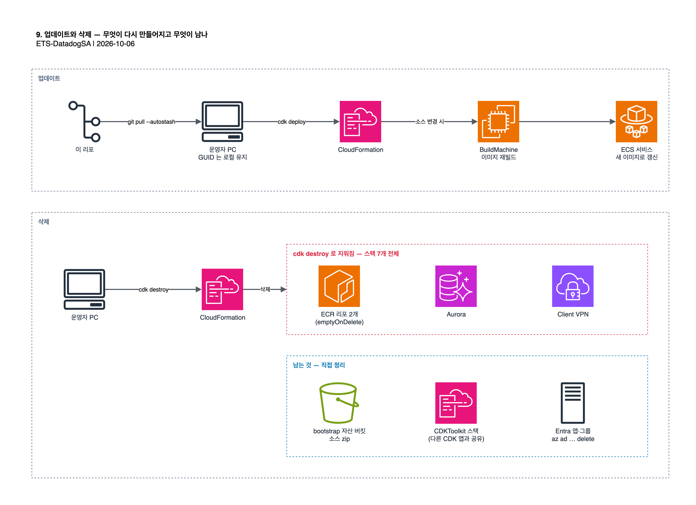

# 9. 업데이트와 삭제



## 9.1 업데이트

이 리포의 변경을 받아 와 재배포합니다. [3.1](03-configure-source.md#31-관리-콘솔의-어드민-그룹-지정)에서 넣은 GUID 는
커밋하지 않은 로컬 수정이므로 `--autostash` 로 잠시 치워 두고 받은 뒤 되살립니다. 같은 줄이 바뀌었다면 충돌이 나므로
직접 맞춥니다. 끝나면 [3.2](03-configure-source.md#32-확인)로 세 값을 다시 확인합니다.

```bash
git pull --autostash && git status --short
```

```bash
cd cdk && npm install && npx cdk deploy --all -c oidcIssuer="$ISSUER" -c oidcClientId="$APP" -c oidcClientSecret="$SECRET" -c adminOktaGroupName="$GRP"
```

`gateway/` 나 `admin-console/` 가 바뀌었으면 BuildMachine 스택이 이미지를 다시 빌드합니다.

## 9.2 스택 삭제

`destroy` 도 스택을 다시 합성하므로 컨텍스트가 필요합니다. 원본 [05-cleanup.md](original/05-cleanup.md) 의 예시에는
`oidcClientSecret` 이 빠져 있어 그대로 실행하면 실패합니다. 새 셸이라면
[4.5](04-deploy.md#45-새-셸에서-변수-복원)로 변수를 먼저 복원합니다.

```bash
npx cdk destroy --all -c oidcIssuer="$ISSUER" -c oidcClientId="$APP" -c oidcClientSecret="$SECRET" -c adminOktaGroupName="$GRP"
```

의존 관계의 역순으로 지워집니다. ECS Express Mode 서비스 두 개(와 Express Mode 가 만든 로드밸런서, 대상 그룹, 보안 그룹),
Aurora Serverless v2 클러스터, 생성된 Secrets Manager 시크릿, VPC(NAT Gateway, 서브넷, 인터페이스 엔드포인트), Client VPN
이 대상입니다. CloudWatch 로그 그룹도 스택이 `RemovalPolicy.DESTROY` 로 관리하므로 함께 지워집니다. 지운 뒤에도 로그를
보려면 먼저 내보냅니다.

남은 스택이 없는지 확인합니다. 빈 결과면 7개 모두 지워진 것입니다.

```bash
aws cloudformation list-stacks --region us-east-1 --stack-status-filter CREATE_COMPLETE UPDATE_COMPLETE DELETE_FAILED --query "StackSummaries[?starts_with(StackName,'ClaudeGateway')].{Name:StackName,Status:StackStatus}"
```

`DELETE_FAILED` 가 보이면 CloudFormation 콘솔에서 그 스택의 이벤트를 열어 지우지 못한 리소스를 찾습니다. 흔한 원인은
다른 리소스가 아직 참조하는 보안 그룹, 또는 템플릿을 고쳐 추가한 S3 버킷이 비어 있지 않은 경우입니다. 원인을 정리한 뒤
`cdk destroy` 를 다시 실행합니다.

BuildMachine 스택이 만든 ECR 리포 2개는 `emptyOnDelete` 로 이미지째 함께 지워집니다. 원본 정리 문서의 ECR 안내는
이 리포의 현재 소스와 맞지 않습니다. `cdk destroy` 가 지우지 않는 것은 다음과 같습니다.

| 항목 | 이유 | 조치 |
| --- | --- | --- |
| CDK bootstrap 자산 버킷(`cdk-hnb659fds-assets-<account>-us-east-1`)에 올라간 `gateway/`·`admin-console/` 소스 zip | 같은 계정·리전의 다른 CDK 앱과 공유 | 필요하면 해당 객체를 직접 삭제 |
| `CDKToolkit` 스택 | bootstrap 결과물로 다른 CDK 앱도 사용 | 그대로 둠 |
| Entra 앱과 어드민 그룹 | AWS 밖의 리소스 | 9.3 |

## 9.3 Entra 정리

```bash
az ad app delete --id "$APP" && az ad group delete --group "$GRP"
```

로컬의 `cdk/cdk.context.json` 과 `claude-gateway-vpn-client.ovpn` 에는 secret 과 VPN 키가 남아 있습니다. 더
쓰지 않으면 지웁니다.

다음: [10. 문제 해결](10-troubleshooting.md)
